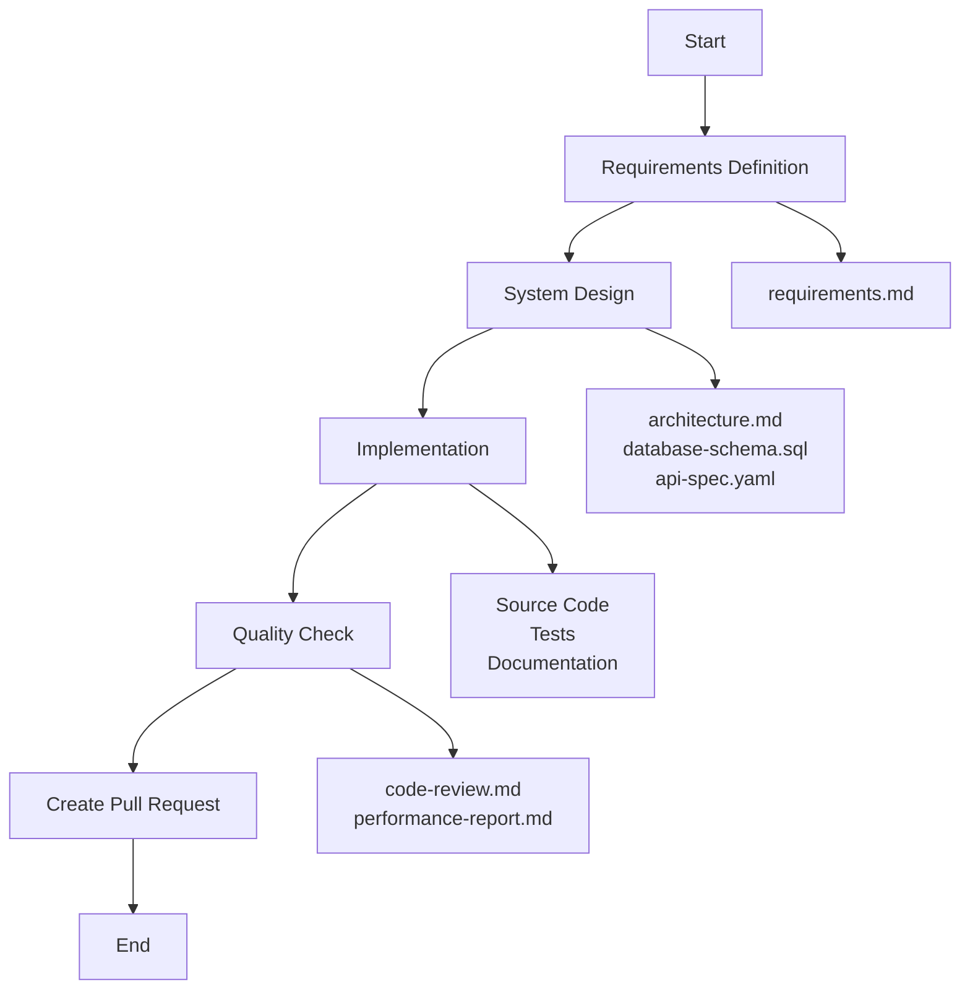

# Claude Code System Builder

GitHub ActionsワークフローでClaude Code SDKを使用して、要件定義からシステム実装まで自動化するツールです。

## 概要

このプロジェクトは、Claude Code SDKを活用してソフトウェア開発プロセス全体を自動化します：

1. **要件定義** - プロジェクトの要件を自動生成
2. **システム設計** - アーキテクチャとデータベース設計を作成
3. **実装** - コードの自動生成とテスト作成
4. **品質チェック** - コードレビューとパフォーマンス分析

## 必要な設定

### 1. GitHub Secretsの設定

リポジトリの Settings > Secrets and variables > Actions で以下を設定：

```
CLAUDE_API_KEY: あなたのClaude APIキー
```

### 2. Claude Code Action の有効化

> **注意**: 現在、`anthropics/claude-code-action@v1` は仮想的なアクションです。
> 実際の使用時は、Claude Code SDKの公式ドキュメントに従って適切なセットアップを行ってください。

## 使用方法

### ワークフローの実行

1. GitHubリポジトリの "Actions" タブに移動
2. "Claude System Builder" ワークフローを選択
3. "Run workflow" をクリック
4. 以下のパラメータを入力：
   - **Project name**: プロジェクト名（例: my-awesome-app）
   - **Project type**: プロジェクトタイプを選択
     - `web`: Webアプリケーション
     - `api`: APIサーバー
     - `cli`: CLIツール
     - `mobile`: モバイルアプリ
   - **Primary language**: 主要なプログラミング言語を選択
     - `typescript`
     - `python`
     - `go`
     - `java`
     - `rust`
   - **Requirements URL**: （オプション）既存の要件定義ドキュメントのURL

### ワークフローの流れ



## 生成されるファイル構造

```
projects/
└── [project_name]/
    ├── requirements.md          # 要件定義書
    ├── architecture.md          # システムアーキテクチャ
    ├── database-schema.sql      # データベーススキーマ
    ├── api-spec.yaml           # API仕様
    ├── src/                    # ソースコード
    ├── tests/                  # テストコード
    ├── docs/                   # ドキュメント
    ├── .github/workflows/      # CI/CD設定
    ├── Dockerfile              # Docker設定
    ├── README.md              # プロジェクトREADME
    ├── code-review.md         # コードレビュー結果
    └── performance-report.md   # パフォーマンス分析結果
```

## 開発ステージワークフロー

`claude-development-stages.yml` を使用して、より詳細な開発ステージを実行できます：

### 利用可能なステージ

1. **design** - 詳細な技術設計
   - コンポーネントアーキテクチャ
   - データベース設計
   - API設計
   - セキュリティ設計

2. **development** - 実装フェーズ
   - 開発環境セットアップ
   - コアモジュール実装
   - APIレイヤー実装
   - フロントエンド実装

3. **testing** - テストフェーズ
   - ユニットテスト作成
   - 統合テスト
   - E2Eテスト
   - パフォーマンステスト
   - セキュリティテスト

4. **optimization** - 最適化フェーズ
   - パフォーマンス最適化
   - コード品質改善
   - リファクタリング

## カスタマイズ

### 要件定義テンプレート

`templates/requirements-template.md` を編集して、組織固有の要件定義フォーマットに合わせることができます。

### ワークフローの拡張

各ステージは独立しているため、必要に応じて新しいステップやジョブを追加できます：

```yaml
- name: カスタムステップ
  run: |
    claude-code <<EOF
    カスタム処理の内容
    EOF
```

## ベストプラクティス

1. **小さく始める**: 最初は小規模なプロジェクトで試してください
2. **レビューを重視**: 生成されたコードは必ずレビューしてください
3. **段階的な採用**: すべてを自動化する前に、各ステージを個別に試してください
4. **カスタマイズ**: プロジェクトのニーズに合わせてワークフローをカスタマイズしてください

## トラブルシューティング

### APIキーエラー
- GitHub Secretsに正しくAPIキーが設定されているか確認
- APIキーの権限が適切か確認

### ワークフロー失敗
- ログを確認して具体的なエラーメッセージを特定
- 必要に応じてワークフローのステップを分割して実行

### 生成コードの問題
- プロンプトをより具体的に調整
- 要件定義をより詳細に記述

## 貢献

プルリクエストを歓迎します。大きな変更の場合は、まずissueを作成して変更内容を議論してください。

## ライセンス

[MIT](LICENSE)